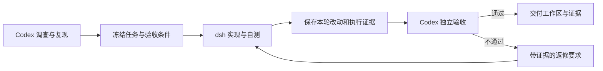

# Codex × DeepSeek Harness Skill

让 **Codex 调查、规划与独立验收**，让 **DeepSeek Harness（dsh）实现代码并自测**。实现失败或验收不通过时，Codex 提供带证据的返修要求，再由 dsh 修复，直至验收通过或出现真实外部阻塞。

本仓库提供可安装的 Codex skill、命令行运行助手、离线回归测试和使用说明。它不是 DeepSeek Harness 本体，也不会替你安装模型服务或配置密钥。



## 适合什么任务

- 希望用 Codex 把控实现方向和质量，由 dsh 执行具体开发。
- 需要保留每轮修改、测试结果和验收依据的 bug 修复或功能开发。
- 希望借助 codegraph、文件搜索和定向测试，减少无关代码阅读与重复调查。

默认串行执行，同一工作区只有一个写入者。当前没有多实例调度、自动合并、自动提交或自动部署。dsh 退出码为 0 只代表模型回合结束，**不等于验收通过**。实际费用和耗时取决于模型、任务及返修情况，本仓库不承诺节省比例。

## 环境要求

| 项目 | 要求 |
|---|---|
| Codex | 支持本地 skill 和命令执行的使用环境 |
| 操作系统 | runner 使用 `fcntl` 和 POSIX 进程组；维护环境为 macOS，原生 Windows 不支持，Linux 需在自己的环境验证 |
| Python | Python 3.10+；运行助手和测试仅使用标准库 |
| Git | 可执行，目标项目已有至少一个提交，能够定位工作区根目录 |
| DeepSeek Harness | `dsh` 在 PATH 中，模型/凭证已配置，headless 能正常运行 |
| codegraph | 优先使用其 CLI 或可用 MCP；不可用时按 skill 的初始化与回退规则处理 |

发布准备时检查的 dsh 版本为 `0.1.5-rc.2`。版本变化后先检查 `dsh --profile headless --help`；这是兼容性观察值，不是强制版本锁定。dsh 的模型请求可能产生费用，离线测试不会调用模型。

## 安装

先按各工具上游说明安装并配置 Codex、DeepSeek Harness 和 codegraph。本仓库只安装 skill：

```sh
git clone git@github.com:KHG420/Codex-DeepSeek-Harness-Skill.git
cd Codex-DeepSeek-Harness-Skill
skill_root="${CODEX_HOME:-$HOME/.codex}/skills"
mkdir -p "$skill_root"
# 首次安装；若目标已存在，先比较并保留本地定制，不直接覆盖。
if [ -e "$skill_root/codex-dsh-workflow" ]; then
  echo "目标已存在，请先检查本地版本。"
else
  cp -R codex-dsh-workflow "$skill_root/codex-dsh-workflow"
fi
```

也可使用 HTTPS 克隆地址：`https://github.com/KHG420/Codex-DeepSeek-Harness-Skill.git`。安装后重新打开 Codex 会话，并确认可发现 `$codex-dsh-workflow`。

更新时在此克隆中运行 `git pull --ff-only`，比较仓库内 `codex-dsh-workflow/` 与已安装目录，再同步需要的文件。复制安装不会自动跟随仓库更新。

## 快速使用

在目标项目的 Codex 会话中明确调用：

> 使用 $codex-dsh-workflow 修复这个问题：……。由 Codex 先复现并冻结验收条件，再由 dsh 实现和自测，最后由 Codex 独立验收。保持最小修改，不提交或部署。

功能任务也可以写：

> 使用 $codex-dsh-workflow 实现……。保留现有 API 和数据格式，先明确允许修改的范围、关键正反例和验证命令，再交给 dsh。

不需要手工复制整份 skill 给 dsh。Codex 编写本轮任务单，运行助手会把执行约束、任务内容及返修意见传给 dsh。普通代码请求不会仅因为安装了此 skill 就自动委派。

开始前可检查：

```sh
command -v dsh
dsh --version
dsh --profile headless --help
command -v codegraph
codegraph --help
```

help 通过不代表真实模型调用成功。首次环境诊断、凭证问题和权限问题见[运行环境与排错](codex-dsh-workflow/references/local-runtime.md)。

## 工具怎样帮助 dsh

dsh 通过自身可用工具执行任务。它可通过 Bash 调用 codegraph CLI，不需要为了代码图谱额外连接 MCP；Codex 当前会话的 MCP、连接器和登录授权不会自动继承。

| 目的 | 推荐方式 |
|---|---|
| 找到相关区域 | `codegraph explore "问题或模块" --max-files 3` |
| 查看符号与源码 | `codegraph node <符号>` |
| 了解调用与影响 | 按需使用 `callers`、`callees`、`impact` |
| 精确字符串、配置或未索引内容 | `rg` 与限定行段的文件读取 |
| 找到可能相关的测试 | `codegraph affected <改动文件>`，再结合既定验收命令 |
| 核实实现 | Git diff、编译器、测试器及本任务必要的其他工具 |

交接时只列本任务所需且已经核实的工具。已有索引按需同步，不反复重建；工具已返回的当前源码不立即重复读取；查询不足时围绕缺口扩大范围。工具失败记录实际错误，不盲目重试、安装依赖或放宽权限。`affected` 的结果不能代替规定的测试。

## 任务、运行与验收

详细命令、完整示例和证据解释见[操作指南](docs/usage.md)。核心约定如下：

1. Codex 阅读项目规则，复现问题，调查根因，写出允许范围与编号验收条件。
2. task、外部验收输入及本轮证据放在项目工作区外；每轮使用新 attempt 目录。
3. dsh 实现、自测并报告；不得自行提交、推送、部署或再委派。
4. Codex 检查本轮增量 diff，独立运行必要验证，确认输入和候选代码未漂移。
5. 只有必要验收全部完成才写 `PASS`；否则返修或说明真实外部阻塞。

原有未提交修改必须保留并明确基线。worktree 不是 OS 沙箱；提示词和 `--capture` 也不是文件写入权限控制。

## 本地验证

在仓库根目录执行：

```sh
python3 codex-dsh-workflow/scripts/test_dsh_run.py
```

当前包含 24 项离线行为测试，覆盖原有脏改动的增量差异、外部输入冻结、证据篡改、失败退出、超时及工作区互斥等。测试使用临时 Git 仓库和 fake-dsh，不调用付费模型，不替代真实模型或跨平台集成测试。

## 目录

```text
README.md
docs/usage.md                         操作、任务示例、证据和排错
codex-dsh-workflow/
  SKILL.md                            Codex 执行规则
  agents/openai.yaml                  显示名称与默认调用提示
  references/handoff.md               任务与验收模板、工具策略
  references/local-runtime.md         可移植的环境诊断
  references/improvement-backlog.md   历史改进与未启用的并发备忘
  scripts/dsh_run.py                  run / check / record
  scripts/test_dsh_run.py             离线行为测试
```

## 维护与反馈

修改运行器前先复现问题，保留最小改动，并运行受影响的离线测试。修改 skill 时同时核对交接模板和运行器内实际传递的提示词，避免文档与执行行为不一致。发布 bug 报告请提供系统、Python/dsh 版本、命令、脱敏错误和最小复现，不附密钥、完整环境变量或私人源码。
